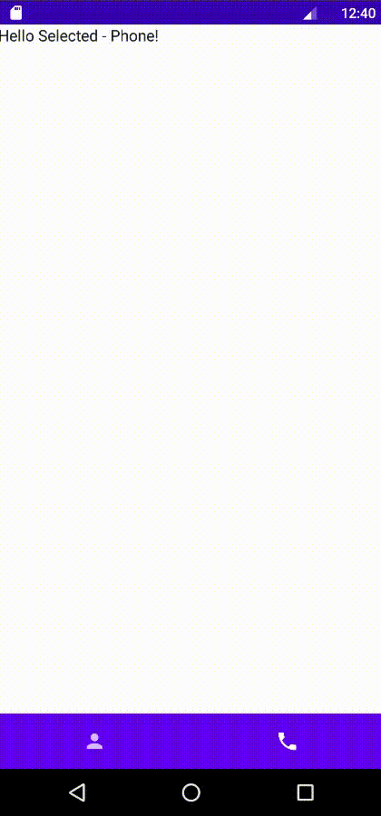

Samples for articles
---

Примеры кода для статей. В этом репозитории находятся примеры только по android.

| Project | |
|:-----|---------|
|   <b>Каррирование глазами android разработчика</b>    28 Июля в мире андройд произошло важное событие - анонсировали [Jetpack Compose 1.0](https://android-developers.googleblog.com/2021/07/jetpack-compose-announcement.html). Вместе с этим нововведением места для ключевого слова `class` стало еще меньше. Kotlin поддерживает парадигму функционального программирования, и разработчики google умело этим пользуются.    **<a href="https://github.com/keygenqt/articles/blob/currying/docs/article.md">> Browse</a>**   |  _______________| 
| | |