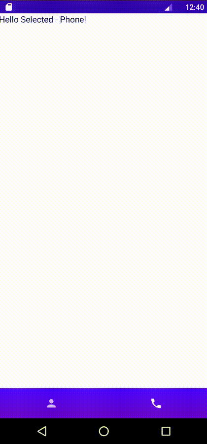

Каррирование глазами android разработчика
---

28 Июля в мире андройд произошло важное событие -
анонсировали [Jetpack Compose 1.0](https://android-developers.googleblog.com/2021/07/jetpack-compose-announcement.html).
Вместе с этим нововведением места для ключевого слова `class` стало еще меньше. Kotlin поддерживает парадигму
функционального программирования, и разработчики google умело этим пользуются. ООП И ФП друг другу не враги как часто
это считается, они могут успешно дополнять друг друга. Одно из понятий фп это каррирование функций, которое может
пригодиться при разработке в compose, и не только. Давайте посмотрим что это такое и как это можно использовать на
практике.

[**More...**](https://github.com/keygenqt/articles/blob/currying/docs/article.md)

### Preview

